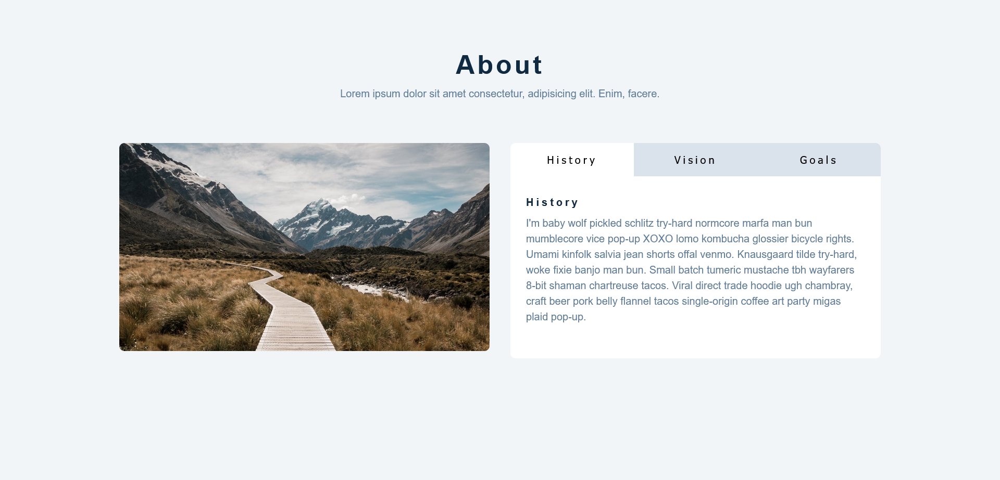

<h1 align="center">Tabs</h1>

It is a JS mini project for practice.

### I learned

In this project I've learnt about <b>data-</b> attribute in html and <b>dataset</b> in js;

### Built With

built with html, css, pure js.
